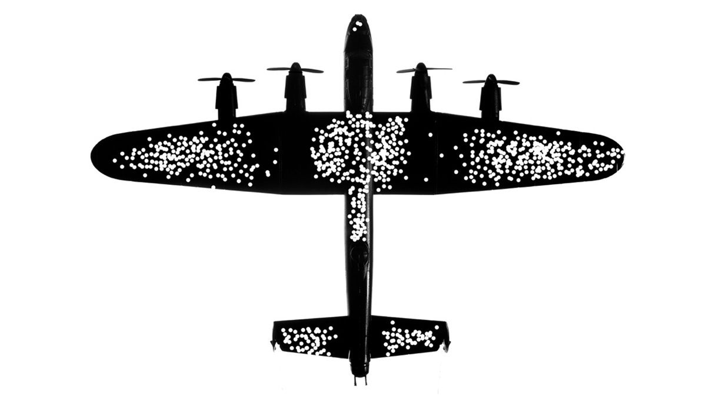

```{r setup, include=FALSE}
# knitr::opts_chunk$set(fig.width=12, fig.height=8, fig.path="/Users/quinxie/Downloads/STA130_TA_training/STA130_Fall_2022/tut_wk1",
#                       echo=FALSE, warning=FALSE, message=FALSE)
```

**Break the ice (5 min)**:  

Starting with the TA, ask everyone in the room to talk about:

What your preferred name is (and pronouns, if you wish)

Which program you're planning to go into

One of the following (stick to 1 or 2):

(1) share a boring fact about yourself 

(2) Something in your life that you are grateful for — nothing is too big or too small

(3) Something you really like OR really dislike.

(4) Something you did in the summer

(5) Something interesting about where you're from (at any level, high school, city, province, country)

(6) 2 truths and 1 lie. (* This one may exceed 5 min)

**Discussion (25 min) **:  

*Can divide the students into 1-3 groups as long as you can keep track of what they're talking about and grade accordingly.

During World War II, the US Statistical Research Group (SRG) worked on a problem about how to best armour the plane.

```{r, echo=FALSE, include=FALSE, out.width='50%', fig.align='left', fig.cap='This Image was released by the United States Air Force with the ID \\newline{}050309-F-1234P-015. Boeing P-12E - National Museum of the US Air Force'}
# knitr::include_graphics('boe_p12e.jpeg')
``` 

- Too much armour is a problem, because planes are heavier, less maneuverable and use more fuel

- Too little armour is a problem, because the planes would get shot down


An observation made by the SRG:

Planes returning from combat were covered in bullet holes, 
but the holes weren't uniformly distributed across the aircraft

```{r, echo=FALSE, out.width='50%', fig.align='left', fig.cap='Source from https://www.trevorbragdon.com/when-data-gives-the-wrong-solution/'}

``` 

```{r table2, echo=FALSE, message=FALSE, warnings=FALSE, results='asis'}
require(pander)
panderOptions('table.split.table', Inf)

# tabl <- "
# | Section of plane                        | Bullet holes per square foot |
# |-----------------------------------------|-----------------------------:|
# | A. Engine                               | 1.11                         |
# | B. Fuselage (main body of the aircraft) | 1.73                         |
# | C. Fuel system                          | 1.55                         |
# | D. Rest of plane (e.g. wings and tail)  | 1.80                         |
# "
# cat(tabl) 
my.data <- "
 Section of plane                        | Bullet holes per square foot 

 A. Engine                               | 1.11                         
 B. Fuselage (main body of the aircraft) | 1.73                         
 C. Fuel system                          | 1.55                         
 D. Rest of plane (e.g. wings and tail)  | 1.80                         
"
set.caption("Distribution of bullet holes across plane sections")
df <- read.delim(textConnection(my.data),header=FALSE,sep="|",strip.white=TRUE,stringsAsFactors=FALSE)
names(df) <- unname(as.list(df[1,])) # put headers on
df <- df[-1,] # remove first row
row.names(df)<-NULL
pander(df, style = 'rmarkdown')
```

<!-- | | | -->
<!-- |-|-| -->
<!-- | Section of plane | Bullet holes per square foot | -->
<!-- | A. Engine | 1.11 | -->
<!-- | B. Fuselage (main body of the aircraft) | 1.73 | -->
<!-- | C. Fuel system | 1.55 | -->
<!-- | D. Rest of plane (e.g. wings and tail) | 1.80 | -->

Discuss: 

Which part of the plane has the greatest need for armour?
Did you all agree? 

Can you change your classmates’ minds to agree with you? Or can they argue persuasively so you agree with them?


**Writing prompt (30 min)**:  

Identify one of the course learning objectives (from the syllabus) that you are most excited about. Describe why this objective is especially interesting to you.

### Some general reminders 

- Try to not send more than 30 minutes on the prompt. 

- Aim for 200 - 500 words. 

- Use full sentences.  

- Grammar is *not* the main focus of the assessment, but it is important that you communicate in a clear and professional manner. I.e., no slang or emojis should appear. 

- Be specific. A good principle when responding to a writing prompt in STA130 is to assume that your audience is not aware of the subject matter (or in this case has not read the syllabus). Therefore, in this case, you need to properly communicate what the objective is putting it in your own words (paraphrasing). You should not just copy the learning objective and put it in quotation marks.  
